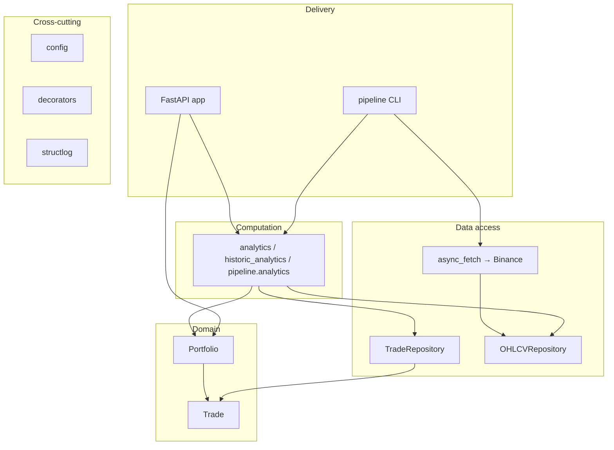
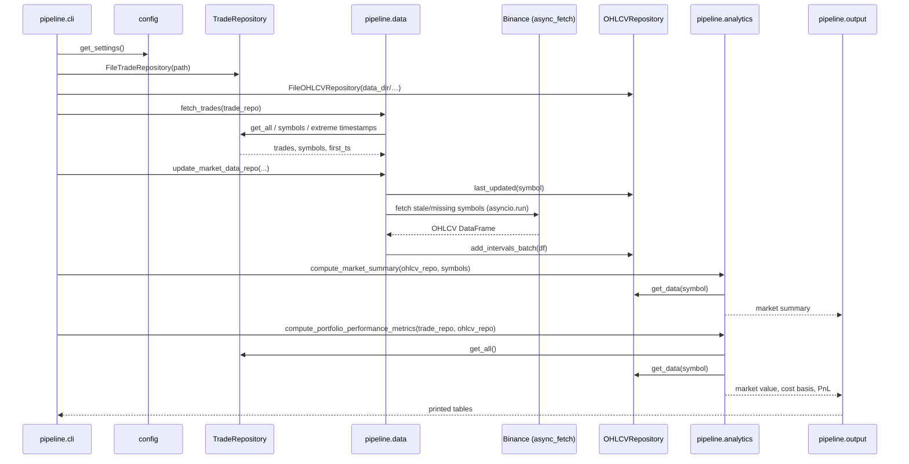

# Architecture

## Overview

`finlib` turns a log of executed trades into portfolio analytics. It loads trades from a repository, fetches matching OHLCV market data from Binance, caches that data locally, and computes market and portfolio metrics (volatility, Sharpe, market value, cost basis, PnL). The same core is exposed two ways: a batch **CLI pipeline** that prints tables to stdout, and an **HTTP API** built on FastAPI.

The codebase is organised in layers. Each layer depends only on the ones beneath it, and the boundary between layers is expressed as a `typing.Protocol` rather than a concrete class. This is the single most important design idea in the project: callers depend on *interfaces*, not implementations, so a backend can be swapped (in-memory for a test, CSV or SQLite in production) without any caller changing.

## Layers

### Domain

`Trade` (`models.py`) and `Portfolio` (`portfolio.py`) are the vocabulary of the system. Both are frozen Pydantic models, so once constructed they are immutable and validated. `Trade` carries a signed `notional` and `lot_size`; `Portfolio` aggregates trades and derives historic position, cost basis, market value, and PnL as pandas DataFrames. The domain layer has no knowledge of storage, HTTP, or Binance — it is pure data plus arithmetic. See [domain-model.md](domain-model.md).

### Data access

Two `Protocol`s define how data enters and leaves the system: `TradeRepository` (`trade_repo.py`) and `OHLCVRepository` (`ohlcv_repo.py`). Each has three interchangeable backends — in-memory, flat file (JSONL/CSV), and SQLite — behind an identical method surface. `async_fetch.py` sits alongside these as the upstream market-data source: the pipeline pulls OHLCV bars from Binance concurrently and stores them into the OHLCV repository. See [repositories.md](repositories.md), [data-ingestion.md](data-ingestion.md), and [async-and-concurrency.md](async-and-concurrency.md).

### Computation

The analytics modules (`analytics.py`, `historic_analytics.py`) compute VWAP, rolling volatility, Sharpe, drawdown, and resampling; `pipeline.analytics` orchestrates them over the repositories and marks the `Portfolio` to market. This layer consumes the domain types and the repository Protocols but knows nothing about how the results will be presented. (`PortfolioService`, a thin position/notional service over a `TradeRepository`, lives here too as a reusable library entry point, though the CLI and API construct `Portfolio` directly.) See [analytics.md](analytics.md).

### Delivery

Two front ends share the computation layer. The **pipeline** (`pipeline/`) is a batch CLI: it wires concrete file-backed repositories, runs the fetch-and-analyse sequence, and prints formatted tables. The **API** (`api/`) exposes the same capabilities as HTTP endpoints, injecting repositories through FastAPI dependencies. See [pipeline.md](pipeline.md) and [http-api.md](http-api.md).

### Cross-cutting

`config.py` centralises settings (via `pydantic-settings` and `.env`), `decorators.py` provides retry/backoff, timing, and input validation applied at layer boundaries, and `structlog` provides structured logging throughout. See [configuration.md](configuration.md) and [decorators-and-utils.md](decorators-and-utils.md).

## Pipeline data flow

The CLI (`pipeline/cli.py`) drives one end-to-end run:

Note the incremental-update logic in `update_market_data_repo`: a symbol is only refetched from Binance if it is missing from the cache or its `last_updated` timestamp is older than `MKT_DATA_UPDATE_FREQ` (one day). That freshness gate is what keeps repeated runs cheap — a symbol updated within the last day triggers no network call at all. When a refetch does happen, the repository's batch insert keeps only bars newer than the last cached one, so overlapping data is deduplicated on write rather than duplicated.

## Design principles

- **Depend on Protocols, not implementations.** Every layer boundary is a structural interface. Callers accept `TradeRepository`/`OHLCVRepository`, never a concrete class, which is what makes backends swappable and tests fast (in-memory) without mocking.
- **Validate at the boundary.** Data is checked the moment it enters the system — Pydantic field constraints on `Trade`, row validation in the OHLCV parser, response parsing in `async_fetch` — so the inner layers can assume well-formed inputs.
- **Immutability by default.** Domain models are frozen; there is no hidden mutable state to reason about.
- **Stream, don't materialise.** Ingestion favours generators and row-by-row processing to keep memory flat regardless of dataset size (see [data-ingestion.md](data-ingestion.md)).
- **Typed, strictly.** The whole tree passes `mypy --strict`, so the Protocols above are enforced at type-check time, not just by convention.

## Where to go next

Start with [domain-model.md](domain-model.md) to learn the core types, then [repositories.md](repositories.md) to see how they are stored and retrieved. From there, the computation and delivery docs build on both.
