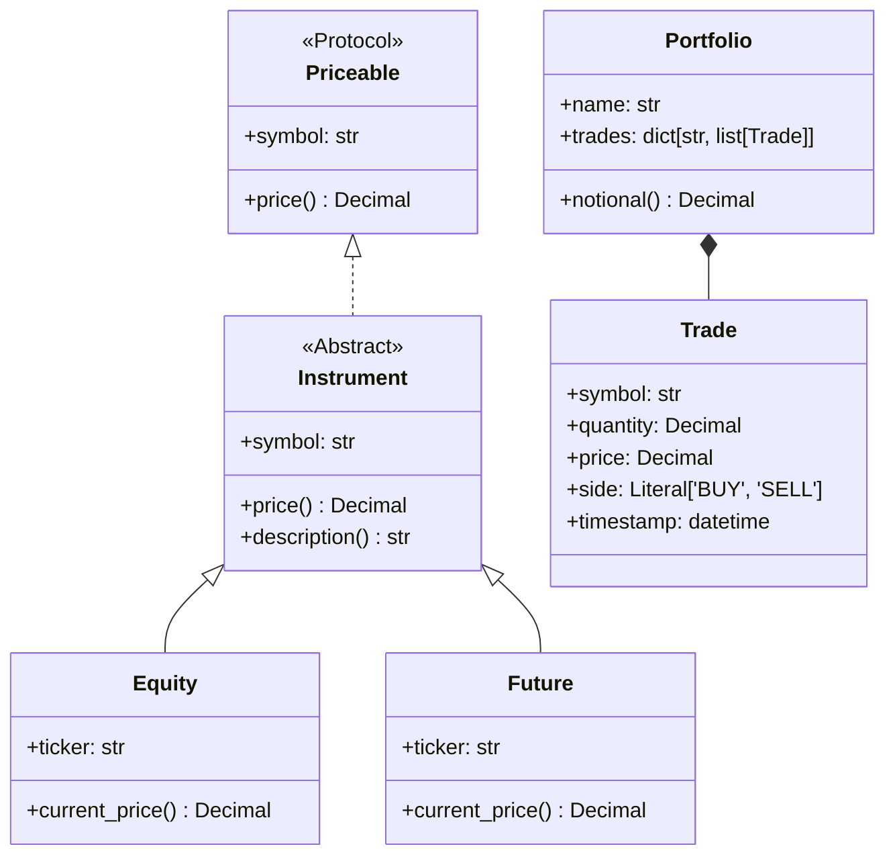

# Class Diagram

```mermaid
classDiagram
    class Priceable {
        <<Protocol>>
        +symbol: str
        +price() Decimal
    }

    class Instrument {
        <<Abstract>>
        +symbol: str
        +price() Decimal
        +description() str
    }

    class Equity {
        +ticker: str
        +current_price() Decimal
    }

    class Future {
        +ticker: str
        +current_price() Decimal
    }

    class Trade {
        +symbol: str
        +quantity: Decimal
        +price: Decimal
        +side: Literal['BUY', 'SELL']
        +timestamp: datetime
    }

    class Portfolio {
        +name: str
        +trades: dict[str, list[Trade]]
        +notional() Decimal
    }

    Priceable <|.. Instrument
    Instrument <|-- Equity
    Instrument <|-- Future
    Portfolio *-- Trade
```