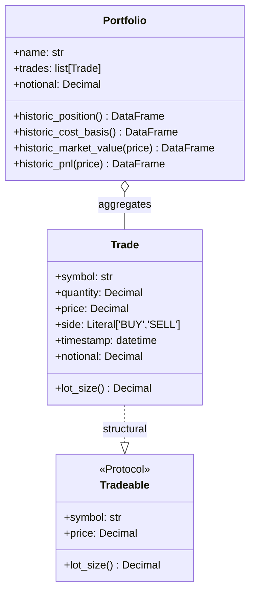

# Domain model

The domain layer is the vocabulary of `finlib`: the two types every other layer is written in terms of. Both live close to the root of the package (`models.py`, `portfolio.py`) and depend on nothing but Pydantic and pandas. They carry no knowledge of storage, HTTP, or Binance.

## `Trade`

A single executed trade. It is a **frozen** Pydantic model, so it is immutable and fully validated at construction.

| Field | Type | Constraint |
|---|---|---|
| `symbol` | `str` | 1–10 chars; upper-cased by a validator |
| `quantity` | `Decimal` | `> 0` |
| `price` | `Decimal` | `> 0` |
| `side` | `Literal["BUY", "SELL"]` | — |
| `timestamp` | `datetime` | defaults to `datetime.now(UTC)` |

Two derived quantities encode the sign convention used everywhere downstream:

- `notional` (property) — **signed** cash value: `+quantity * price` for a `BUY`, negative for a `SELL`.
- `lot_size()` — **signed** quantity: `+quantity` for a `BUY`, `-quantity` for a `SELL`.

**Why `Decimal` rather than `float`?** Prices and quantities are money. Binary floating point cannot represent values like `0.1` exactly, and rounding error accumulates across a sum of trades. `Decimal` keeps the arithmetic exact, which matters when notionals are aggregated into positions and PnL.

**Why frozen?** Immutability removes a whole class of bugs — a `Trade` cannot be mutated after it has been recorded, so the same object can be shared freely across a portfolio, a repository, and an analytics call without defensive copying.

## `Tradeable`

A `runtime_checkable` `Protocol` describing anything with a `symbol`, a `price`, and a signed `lot_size()`. `Trade` satisfies it structurally — there is no explicit inheritance. The free function `is_valid_trade_size(instrument, notional)` accepts any `Tradeable` and checks that `lot_size() * price == notional`.

**Why a Protocol here?** It lets size-validation logic apply to `Trade` today and to any future instrument type that exposes the same three members, without a shared base class. This is the same structural-subtyping idea the repositories use, applied to the domain.

## `Portfolio`

An aggregate of trades, also a frozen Pydantic model. It requires a non-empty `name` and at least one `Trade`. It implements the sequence protocol (`__len__`, `__iter__`, `__getitem__`, `__contains__` by symbol) so it reads like a collection, and exposes a `notional` property that sums the signed notionals of its trades.

Its real work is four pandas-returning methods, each indexed by timestamp with one column per symbol:

| Method | Returns |
|---|---|
| `historic_position()` | Cumulative signed quantity held per symbol over time |
| `historic_cost_basis()` | **Minus** the cumulative signed notional (cash paid/received) |
| `historic_market_value(price)` | Position re-priced at mark-to-market `price` |
| `historic_pnl(price)` | `market_value + cost_basis` |

### The sign convention, and why PnL is a sum

The cost basis is deliberately stored as the *negative* cumulative notional. A `BUY` has a positive notional (cash out), so it contributes negatively to cost basis; a `SELL` (cash in) contributes positively. Because cost basis is already negated, PnL is simply `market_value + cost_basis` rather than a subtraction. Concretely: buy 100 @ 10 (cost basis `-1000`), later the mark is 12 (market value `+1200`), PnL `= 1200 + (-1000) = 200`. Keeping one consistent sign rule across `notional`, `lot_size`, and `cost_basis` means every downstream formula is an addition and there is no place to get a sign backwards.

### Timestamp alignment

`historic_market_value` reindexes the (sparse) position series onto the price index with a forward fill (`method="ffill"`), so a position established at trade time is carried forward and valued at every subsequent price observation. It raises `ValueError` if the price frame is missing any symbol the portfolio holds — a fail-fast check at the point where market data meets positions.

## See also

- [repositories.md](repositories.md) — how `Trade`s are persisted and retrieved.
- [analytics.md](analytics.md) — the market-data statistics that complement these portfolio methods.
